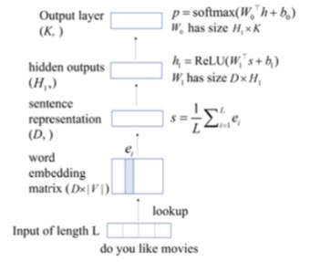

# Deep-Learning-for-VUI

Amazon Alexa is one of the most popular representatives of today’s voice-powered conversational agents. These kind of voice user interface (VUI) platforms allow the third-party developers to freely design and build their own voice applications. However, how to evaluate these voice applications still needs exploring. As indicated in [1], topic Analysis for these voice applications is crucial in evaluating them. In this project, I deploy deep learning methods (e.g. DAN, text CNN, skip-gram) to conduct topic analysis based on my self-collected Alexa skill dataset. This project uses a machine learning algorithm (LR) to generate baseline. Both DAN & text CNN have better performance (with fastText embedding) , as well as DAN with self-generated skip-gram embedding matrix.

## Data Collection -- Alexa Crawler

In order efficiently conduct data collection, I developed a crawler to automate the task of collecting a large sample of skills’ responses to voice commands [2]. This crawler follows the basic Alexa interaction mode of "open-command-stop" to initiate the skill and exit. As indicated in the follow figure, this crawler simulates the voice interaction between users and Alexa devices.

The crawler iterated through over 40,000 Alexa skills to perform this reponses data collection process for each skill, which is described pragmatically as Algorithm 1. 

In order to generate adaptive commands list for each skill, I deployed Stanford CoreNLP package to parse the instruction sentence each skill has.

## Dataset

From the voice application crawler, I retrieved the Alexa Skills Responses Dataset. The details are displayed in the following table and the distribution bar chart which indicates the general Alexa skills distribution across different topics.

## Baseline generation

I used Logistic Regression (LR) to conduct topic classification (15 topics) and grid search was deployed to find the best parameters. As for feature engineering, 6 features were extracted: 1. Bag of words; 2.Tags frequency; 3. Name-entity frequency; 4. Sentence length; 5. Sentence entropy; 6. LDA. The accuracy on test set is 0.632.

## Deep Learning methods

### DAN and textCNN with fastText embedding

I first used pre-trained embedding fastText (https://fasttext.cc/docs/en/english-vectors.html) to train both Deep Average Network (DAN) and text CNN. The structure of DAN is as follows:

DAN is a bag-of-words neural model. It averages the word embeddings in each input utterance as the utterance representation, then the representation is passed through a series of fully connected layers and a softmax output layer for classification. The loss graph is shown as follows:

### DAN with self-trained skip-gram embedding

We also used skip-gram model to train our own embeddings. The following is a visualization for the word vectors. I used T-SNE to visualize these high-dimensional word vectors.

## Results

The following table shows the trainning results:

## Conclusion and analysis

1. Deep Learning methods outperform the LR baseline in terms of classification accuracy. 
2. DAN with fastText embedding has the best performance. One biggest characteristic ofmy dataset is that there is too much noise (including the limitation of Alexa’s error handling ability). In this case, DAN’s robustness to noise can result in better performance, as well as its ability in memorizing keywords. 
3. Our DAN with self-trained skip-gram embedding matrix (Fig 5)  also outperforms the baseline. This result indicates the potential of our datasets developing to a robust pre-trained word vectors. 

## Future work

The analysis above proves the feasibility of deploying deep learning methods to conduct voice application evaluation. Based on this, In the future work, a chatbot trained by deep learning methods using the Alexa responses dataset can be deployed to do evaluation.

